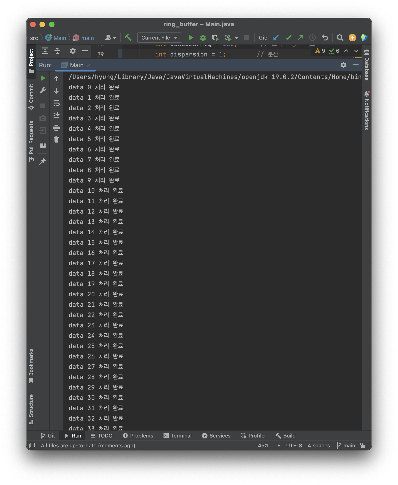

# ringBuffer
링버퍼 구현

<h2>(a) data의 평균발생속도보다 평균 처리 속도가 빠른 경우<h2> 

<h3>1) 버퍼 크기 10, 평균 발생 / 처리 시간 = 110ms / 100ms, 분산 10</h3>
</img> 
처리속도가 10ms 더 빠르게 설정해 놓은 상태. 초기 버퍼가 비어있으므로 버퍼에 data가 들어갈 때마다 소비하고 더 빠르게 data를 요청하므로 계속해서 버퍼가 비어있다는 메세지가 뜨는 것을 볼 수 있다. 하지만 가끔 분산으로 인해 가끔 data가 빠르게 들어오거나 느리게 소비할 때 메시지가 뜨지 않는 것도 볼 수 있다.
   
<h3>2) 버퍼 크기 10, 평균 발생 / 처리 시간 = 110ms / 100ms, 분산 30<h3> 
</img> 

동일하게 처리 속도가 10ms 더 빠르지만 분산을 30으로 증가시킨 결과 데이터를 소비할 때 버퍼가 비어있는 경우가 줄었다.   

<h2>(b) data의 평균 발생속도와 평균 처리속도가 같은 경우</h2> 
<h3>1) 버퍼 크기 10, 평균 발생 / 처리 시간 = 100ms / 100ms, 분산 1</h3> 
</img> 
속도가 같고 분산이 1일 때는 거의 안정적으로 데이터를 생산하고 소비하는 모습을 보였습니다.
   

<h3>2) 버퍼 크기 10, 평균 발생 / 처리 시간 = 100ms / 100ms, 분산 10</h3>
</img> 

속도가 같고 분산을 10으로 증가시켰을 경우에는 초기 버퍼에 데이터가 비어있었으므로 종종 소비자 스레드가 비어있는 버퍼에서 데이터를 요구하는 경우가 있었습니다.
   

<h3>3) 버퍼 크기 10, 평균 발생 / 처리 시간 = 100ms / 100ms, 분산 10 / 초기 데이터 5개를 버퍼에 넣어주고 시작</h3> 
</img> 

초기 데이터 0, 1, 2, 3, 4 를 버퍼에 넣어준 상태로 시작하니 더욱 안정적으로 계속해서 진행하는 모습을 볼 수 있습니다.   

<h3>4) 버퍼 크기 2, 평균 발생 / 처리 시간 = 100ms / 100ms, 분산 10 / 초기 데이터 1개를 버퍼에 넣어주고 시작</h3> 
<table border='0'>
  <tr>
  <th></img> </th>
  <th></img> </th>
  </tr>
</table>
버퍼의 크기를 2로 줄이고 초기 데이터 1개를 넣어주고 시작해 봤더니 버퍼가 비기도 하고 버퍼가 다 찬 상태가 되기도 하는 불안정한 모습을 보였습니다.
   

<h2>(c) data의 평균 발생속도보다 평균 처리속도가 느린 경우</h2>
<h3>1) 버퍼 크기 10, 평균 발생 / 처리 시간 = 100ms / 110ms, 분산 10<h3> 
</img> 

버퍼 크기가 10이고, 발생 속도가 소비 속도보다 10ms 빨랐을 때 data 113 정도부터 버퍼가 꽉 차는 것을 볼 수 있었습니다.   

<h3> 2) 버퍼 크기 30, 평균 발생 / 처리 시간 = 100ms / 110ms, 분산 10</h3> 
</img> 

버퍼 크기가 30일 때는 data 276 정도부터 버퍼가 꽉 차는 것을 볼 수 있었습니다.   

<h3>3) 버퍼 크기 10, 평균 발생 / 처리 시간 = 100ms / 110ms, 분산 30</h3> 
</img> 

버퍼 크기가 10이고 분산이 30일 때는 data 95 부터 버퍼가 꽉 차는 것을 볼 수 있습니다.   

<h1>real-time system 관점에서 분석</h1>

(a) 데이터의 평균 발생 속도보다 평균 처리 속도가 빠른 경우:
데이터는 빠르게 처리되고 버퍼에 쌓이지 않습니다. 평균 처리 속도가 발생 속도보다 빠르기 때문에 버퍼가 계속 비어있는 상태일 가능성이 높습니다. 이는 시스템의 자원이 효율적으로 사용되지 않는 상황이라고 볼 수 있습니다. 데이터가 빨리 처리되므로 실시간 시스템의 요구 사항을 충족시킬 수 있지만, 데이터의 발생 속도를 최대한 활용하지 못하고 있습니다. 따라서, 실시간 시스템에서는 데이터의 발생 속도와 처리 속도를 균형있게 맞춰야 합니다.

(b) 데이터의 평균 발생 속도와 평균 처리 속도가 같은 경우:
데이터의 발생 속도와 처리 속도가 일치하여 데이터는 고르게 처리됩니다. 버퍼는 항상 적정한 상태를 유지하게 됩니다. 실시간 시스템에서는 이러한 상황이 이상적입니다. 데이터는 실시간으로 처리되며, 버퍼는 항상 적절히 유지되므로 시스템은 효율적으로 작동할 수 있습니다.
하지만 분산이 이상적인 상황을 계속 유지하려면 충분한 버퍼의 크기를 가져야 하고, 데이터의 생산, 처리 속도의 분산을 적절하게 유지시켜야 합니다.

(c) 데이터의 평균 발생 속도보다 평균 처리 속도가 느린 경우:
데이터는 발생 속도보다 처리 속도가 느려서 버퍼에 쌓이게 됩니다. 평균 처리 속도가 발생 속도보다 낮기 때문에 버퍼가 계속 채워진 상태가 될 가능성이 높습니다. 이는 시스템의 자원을 효율적으로 사용하지 못하고 데이터 처리의 지연을 초래할 수 있습니다. 만약 실시간 시스템에서 중요한 데이터가 이러한 상황에서 처리되지 않는다면, 시스템의 신뢰성과 성능에 문제가 발생할 수 있습니다.
  
- 정리:
  실시간 시스템에서는 데이터의 발생 속도와 처리 속도를 균형 있게 유지하는 것이 중요합니다. 데이터의 발생 속도가 빠를 경우에는 처리 속도를 높이는 방법을 고려해야 하고, 처리 속도가 빠를 경우에는 데이터의 발생 속도를 조절하는 방법을 고려해야 합니다. 또한, 버퍼의 크기도 고려해야 하며, 버퍼가 계속 채워져 있는 상태를 피하기 위해 데이터의 유효 기간과 우선순위 등을 고려하여 데이터 처리를 조정해야 합니다.